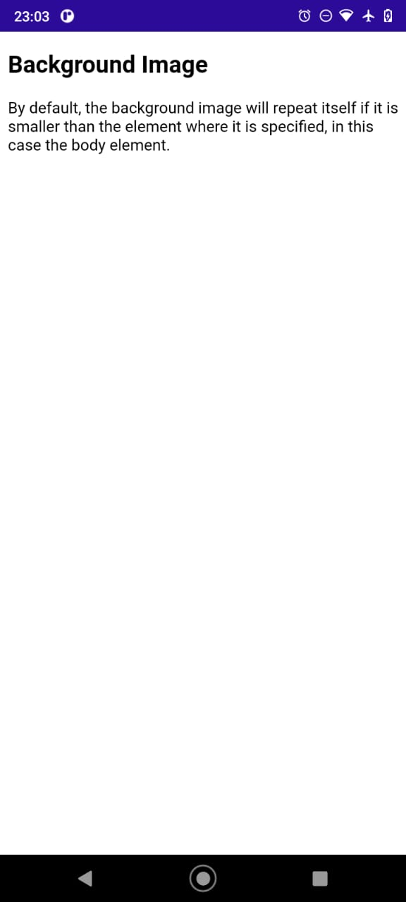

# MAUI-WebView-BackgroundImage
Repro for bug MAUI WebView is not displaying body background-image #4733

When debugging on Android 11 Device, the WebView does not display the background image of this URL https://maui20220216.azurewebsites.net/test.html



I observed this on my phone, a HMD Global Nokia 5.3 (Android 11.0 - API 30)

```
Microsoft Visual Studio Community 2022
Version 17.2.0 Preview 2.0
VisualStudio.17.Preview/17.2.0-pre.2.0+32314.265
Microsoft .NET Framework
Version 4.8.04161

Installed Version: Community

Visual C++ 2022   00482-90000-00000-AA734
Microsoft Visual C++ 2022

.NET Core Debugging with WSL   1.0
.NET Core Debugging with WSL

ADL Tools Service Provider   1.0
This package contains services used by Data Lake tools

ASA Service Provider   1.0

ASP.NET and Web Tools 2019   17.2.240.24236
ASP.NET and Web Tools 2019

Azure App Service Tools v3.0.0   17.2.240.24236
Azure App Service Tools v3.0.0

Azure Data Lake Tools for Visual Studio   2.6.5000.0
Microsoft Azure Data Lake Tools for Visual Studio

Azure Functions and Web Jobs Tools   17.2.240.24236
Azure Functions and Web Jobs Tools

Azure Stream Analytics Tools for Visual Studio   2.6.5000.0
Microsoft Azure Stream Analytics Tools for Visual Studio

C# Tools   4.2.0-2.22159.10+f3a5bad242b7a7b8149ae644de0a61c2f1bffc8d
C# components used in the IDE. Depending on your project type and settings, a different version of the compiler may be used.

Common Azure Tools   1.10
Provides common services for use by Azure Mobile Services and Microsoft Azure Tools.

Extensibility Message Bus   1.2.6 (master@34d6af2)
Provides common messaging-based MEF services for loosely coupled Visual Studio extension components communication and integration.

Microsoft Azure Hive Query Language Service   2.6.5000.0
Language service for Hive query

Microsoft Azure Stream Analytics Language Service   2.6.5000.0
Language service for Azure Stream Analytics

Microsoft JVM Debugger   1.0
Provides support for connecting the Visual Studio debugger to JDWP compatible Java Virtual Machines

Microsoft MI-Based Debugger   1.0
Provides support for connecting Visual Studio to MI compatible debuggers

Microsoft Visual Studio Tools for Containers   1.2
Develop, run, validate your ASP.NET Core applications in the target environment. F5 your application directly into a container with debugging, or CTRL + F5 to edit & refresh your app without having to rebuild the container.

Mono Debugging for Visual Studio   17.1.10 (65f98f5)
Support for debugging Mono processes with Visual Studio.

NuGet Package Manager   6.2.0
NuGet Package Manager in Visual Studio. For more information about NuGet, visit https://docs.nuget.org/

Office Developer Tools for Visual Studio   17.0.32314.00
Microsoft Office Developer Tools for Visual Studio

Razor (ASP.NET Core)   17.0.0.2215202+658e2db05d0daa9326356ee1edc85cd3d1b970c4
Provides languages services for ASP.NET Core Razor.

SQL Server Data Tools   17.0.62203.01080
Microsoft SQL Server Data Tools

SQLite & SQL Server Compact Toolbox   4.8
SQLite & SQL Server Compact Toolbox adds scripting, import, export, rename, query execution and much more to SQL Server Compact & SQLite Data Connections.

Test Adapter for Boost.Test   1.0
Enables Visual Studio's testing tools with unit tests written for Boost.Test.  The use terms and Third Party Notices are available in the extension installation directory.

Test Adapter for Google Test   1.0
Enables Visual Studio's testing tools with unit tests written for Google Test.  The use terms and Third Party Notices are available in the extension installation directory.

ToolWindowHostedEditor   1.0
Hosting json editor into a tool window

TypeScript Tools   17.0.10302.2001
TypeScript Tools for Microsoft Visual Studio

Visual Basic Tools   4.2.0-2.22159.10+f3a5bad242b7a7b8149ae644de0a61c2f1bffc8d
Visual Basic components used in the IDE. Depending on your project type and settings, a different version of the compiler may be used.

Visual F# Tools   17.1.0-beta.22108.1+63bcc94efda4fe19b612b167a25fdbcee796040b
Microsoft Visual F# Tools

Visual Studio IntelliCode   2.2
AI-assisted development for Visual Studio.

Visual Studio Tools for Containers   1.0
Visual Studio Tools for Containers

VisualStudio.DeviceLog   1.0
Information about my package

VisualStudio.Mac   1.0
Mac Extension for Visual Studio

VSPackage Extension   1.0
VSPackage Visual Studio Extension Detailed Info

Workflow Manager Tools 1.0   1.0
This package contains the necessary Visual Studio integration components for Workflow Manager.

Xamarin   17.2.0.67 (main@19e0f04)
Visual Studio extension to enable development for Xamarin.iOS and Xamarin.Android.

Xamarin Designer   17.2.0.64 (remotes/origin/main@3d19e6caf)
Visual Studio extension to enable Xamarin Designer tools in Visual Studio.

Xamarin Templates   17.1.13 (bb31b34)
Templates for building iOS, Android, and Windows apps with Xamarin and Xamarin.Forms.

Xamarin.Android SDK   12.2.99.130 (main/e89ae42)
Xamarin.Android Reference Assemblies and MSBuild support.
    Mono: f34bd77
    Java.Interop: xamarin/java.interop/main@aae23c97
    ProGuard: Guardsquare/proguard/v7.0.1@912d149
    SQLite: xamarin/sqlite/3.38.0@ccd83d8
    Xamarin.Android Tools: xamarin/xamarin-android-tools/main@f0b3abd


Xamarin.iOS and Xamarin.Mac SDK   15.7.0.410 (478c1d2c8)
Xamarin.iOS and Xamarin.Mac Reference Assemblies and MSBuild support.
```
